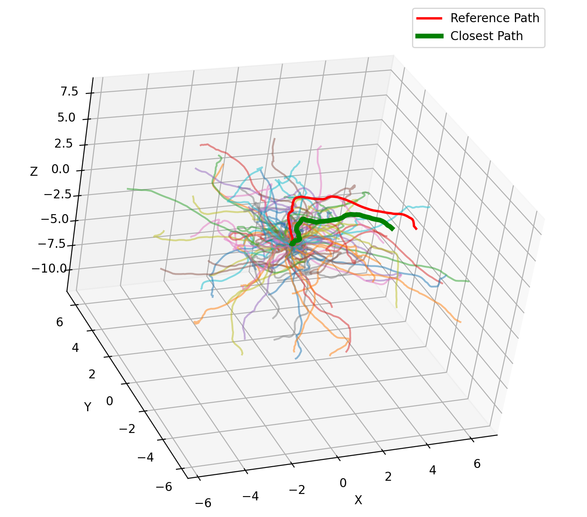

# ecn_ga-mppi
ECN M1 group project: Mixing MPPI with genetic algorithms

## 4T Underwater ROV model and Random Path Generator
We assume a neutrally buoyant robot with thrusters arranged to control four degrees of freedom (4-DOF).

1. The 4-DOFs of control: Surge (x), sway (y), heave (z), and yaw (ψ).
2. Two horizontal thrusters angled at ±45° for surge/sway control.
    - Two vertical thrusters for heave.

    - Differential thrust generates yaw moments.

3. Lastly, we assume passive stability in: Roll (ϕ) and pitch (θ), i.e., those are neglected in control due to metacentric stability.

---
In the `src` folder, there two python files:
1. **`motionModel.py`**: Similar structure as the unicycle model. NOTE: The jacobians A, B here are highly experimental and are pieced together from different sources and AI. This needs fixing!

2. **`pop_generator.py`**: Similar structure to the unicycle population generator. Here, the trajectories are mapped, obviously, in 3D and some visual changes are made to make the reference path (`ref`) and the closest path (`closest_path`) (Euclidean closest) are easily visible. Please note that this is also just a sample code, as you can't change the initial state of the model dynamically.

## Prerequisites:
No change in requirements from the unicycle model. Just plain old python3.x and these:
- numpy==2.x.x
- matplotlib==3.x.x

## Usage:
Again, no major changes from the unicycle model.
1. To run the generator, simply clone this repo:
```bash
git clone https://github.com/Zeraphu/ecn_ga-mppi.git
cd ecn_ga-mppi/
git checkout underwater-rov
```
2. Run the `motionModel` script to see an example usage:
```bash
python3 path/to/motionModel.py
```
3. Run the `pop_generator` script to see a random population, a randomly chosen reference path and the closest path from the population calculated using Euclidean distances.
```bash
python3 path/to/pop_generator.py
```
After running `pop_generator.py`, it should look something like this (starting at [0, 0, 0]):
