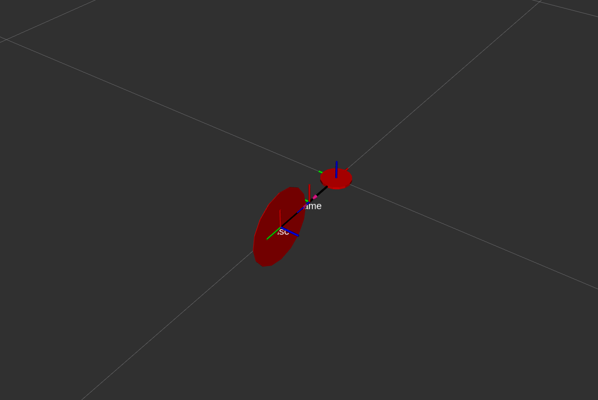
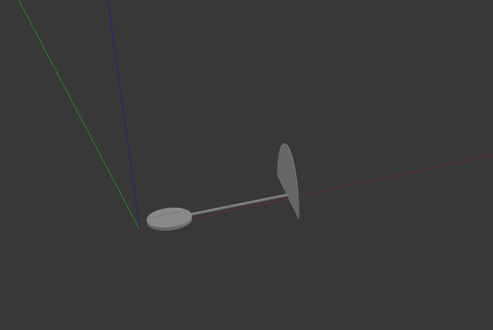

# ecn_ga-mppi
ECN M1 group project: Mixing MPPI with genetic algorithms

## Barebones gazebo model for a unicycle robot
In order to run this simulation, follow these steps:
1. Pull this repo locally and checkout to `unicycle` branch, i.e., inside your src folder, run:
```bash
git clone https://github.com/Zeraphu/ecn_ga-mppi.git
cd ecn_ga-mppi/
git checkout unicycle
```
2. Build the package using (at your worksace root):
```bash
cd ../  
colcon build --symlink-install
```
3. Finally, source and launch the simulation:
```bash
source install/setup.bash
ros2 launch unicycle uni_barebones.launch.py
```
And that should give you a dead unicycle on the floor:



Meant to be inspired from this robot: [YouTube video](https://www.youtube.com/watch?v=yYkTyglPhxs)
