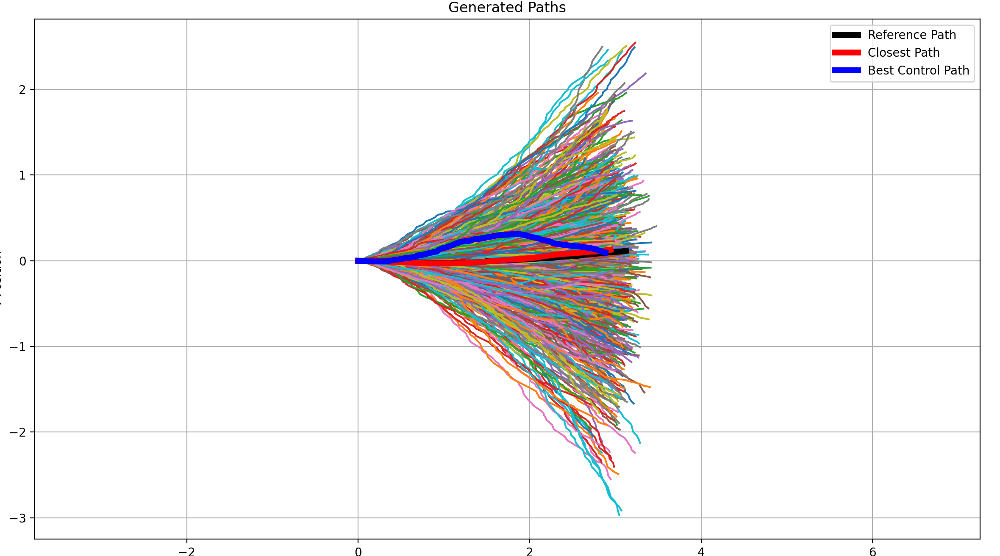

# ecn_ga-mppi
ECN M1 Group Project: Integrating MPPI with Genetic Algorithms

## Unicycle Model and Random Path Generator

The `src` folder includes two Python files:

1. **`motionModel.py`**:  
    This file defines the unicycle motion model for the TurtleBot and provides a path prediction function, `predict`, within the `turtleModel` class.

2. **`pop_generator.py`**:  
    This script performs the following tasks:  
    - Generates a reference path (a randomly generated line of length `horizon`).  
    - Creates `num_paths` random paths using the `turtleModel` class.
    - Identifies the closest path to the reference using the Euclidean norm.
    - Identifies the best path acc. to control law.
    - Visualizes all random paths and highlights the closest path, best control path and the reference path, using `matplotlib`.

3. **`map_generator.py`**:
    This script generates random maps of given dimensions, with scattered obstacles of given density. It can also save the map in a `.npy` file and its params in a `.yaml` file of the same name in the `maps` folder. Two demo maps are already generated and can be visualized by running the `map_generator` directly.

4. **`astar.py`**:
    This script contains a pythonic implementation of the A* algorithm specifically for our occupancy maps in .npy format. Refer to the example usage in the script for more info.
    - Loads a user given map from the maps folder.
    - Takes inputs for the start and end co-ords for path planning.
    - If path found, you can save the path as a `.npy` file with the same name of the map + start & end coords.
    - Use the numpy array in the `.npy` path file to then generate motionModel paths.

5. **`ga_costs.py`**:
    This script contains three variations of cost functions for control law cost with three open functions: `compute_path_curvature_cost`, `compute_control_variation_cost`, and `compute_control_effort_cost`. Lastly, `compute_total_cost` function which computes all costs with user-defined weights.

6. **`ga_algo.py`**:
    NOTE: WIP version of the GA in python3. It visualizes the closest_path, best control path and the total best path. Looks like this right now:
    

### Prerequisites
To use the path generator, ensure you have Python 3.x installed along with the following libraries:  
- `numpy`  
- `matplotlib`

### Usage
1. To run the generator, simply clone this repo:
```bash
git clone https://github.com/Zeraphu/ecn_ga-mppi.git
cd ecn_ga-mppi/
git checkout unicycle
```
2. And then run the `pop_generator.py` file:
```bash
python3 path/to/pop_generator.py
```
Or just use the VSCode play button :) This is the current output:


### Next steps
1. ~~Refactor path generation to utilize NumPy operations, instead of explicit loops.~~
2. Define a new python file called `ga_costs.py` containing a cluster of functions for:
    - ~~**closest path to the reference path** (Euclidean norm of difference between random path and reference)~~
    - **advance** (Euclidean distance between initial and final state, i.e., only x, y values)
    - **obstacles** (Average distance of a path to an obstacle)
    - ~~**control law** (Smoothness of control by calculating the difference array of `v` (linear velocity) and `w` (angular velocity) values from an input array `U` of a random path. The Euclidean norm of these differences is then computed to quantify the smoothness of the control inputs.)~~
    - Tune weights associated with each cost.
3. ~~Define a map using occupancy grid and generate a reference path using A* using python/numpy arrays.~~
4. Define a new GA population in the form of UX:C, where:
    - **UX**: A custom class that encapsulates `U` (control inputs such as linear and angular velocities) and `X` (the corresponding states resulting from these inputs).
    - **C**: The costs associated with the inputs and states, calculated using the functions defined in `ga_costs.py`.
5. Write functions for GA like cross-over and mutation. 
6. Write a GA loop with cost and time thresholds.
7. Integrate with ROS somehow (for testing).